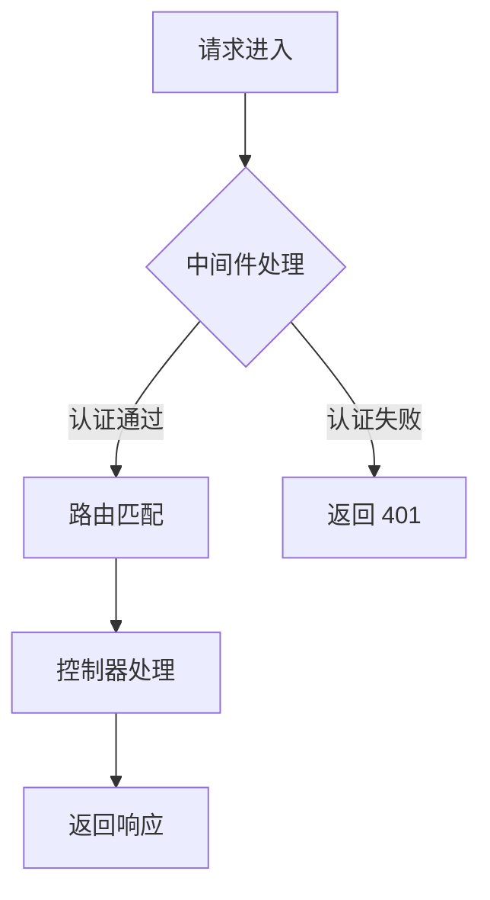
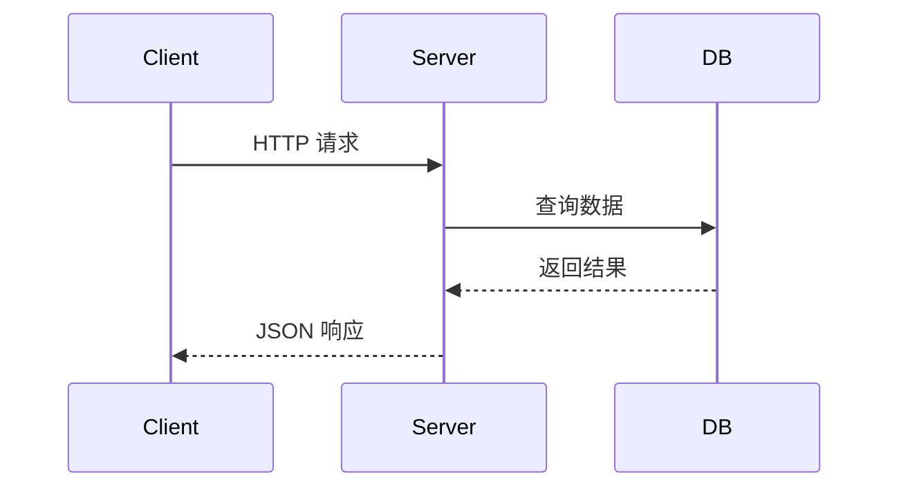
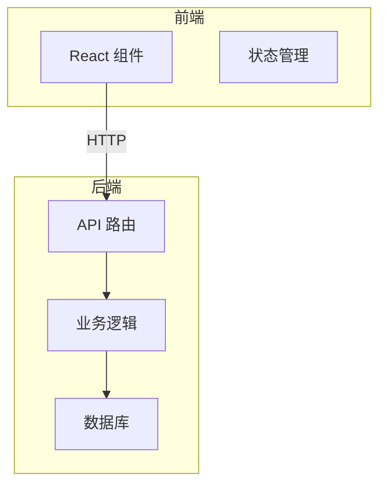

# 可视化辅助指南

本文件为知识模式和项目模式共用的可视化工具箱。在讲解、总结阶段灵活运用，帮助用户建立直观理解。

## 原则

- **用图不讲图**：图是辅助理解的工具，不是目的。能用一句话说清的不画图。
- **匹配场景**：不同知识点适合不同形式的图，见下表。
- **渐进展示**：先讲核心流程的简图，细节在后续节点中展开，不要一次画完整架构图。

## 图表类型选择

| 场景 | 推荐形式 | 示例 |
|------|----------|------|
| 执行流程 / 数据流转 | Mermaid 流程图 | React Fiber 渲染流程、请求生命周期 |
| 模块关系 / 依赖关系 | Mermaid 图或 ASCII | Express 中间件链、React 组件树 |
| 架构层次 | 分层 ASCII 图 | MVC 架构、TCP/IP 分层 |
| 状态变化 / 时序 | Mermaid 时序图 | WebSocket 握手、React Hooks 调用顺序 |
| 对比差异 | 表格 | var/let/const 对比、TCP vs UDP |
| 数据结构 | ASCII 图示 | 链表、树、Fiber 节点结构 |
| 算法步骤 | ASCII + 代码注释 | 排序过程演示 |

## Mermaid 图模板

### 流程图



### 时序图



### 架构图



## ASCII 图示模板

### 分层架构

```
┌─────────────────────────┐
│      应用层 (HTTP)       │  ← 你写的 Express 路由
├─────────────────────────┤
│      传输层 (TCP)        │  ← socket.io 底层依赖
├─────────────────────────┤
│      网络层 (IP)         │
├─────────────────────────┤
│      数据链路层          │
└─────────────────────────┘
```

### 数据结构

```
Fiber 节点结构:
┌──────────┐
│  return   │──→ 父节点
├──────────┤
│  child    │──→ 第一个子节点
├──────────┤
│ sibling   │──→ 下一个兄弟节点
├──────────┤
│  state    │   状态数据
│  props    │   属性数据
└──────────┘
```

### 流程图

```
用户点击 → 触发 setState
              ↓
         入队更新(updateQueue)
              ↓
         调度器(Scheduler)决定优先级
              ↓
       ┌──────┴──────┐
    高优先级        低优先级
       ↓              ↓
   立即渲染        延后渲染
       ↓              ↓
       └──────┬──────┘
              ↓
       生成 Fiber 树(reconciliation)
              ↓
         提交到 DOM(commit)
```

## 表格使用场景

### 对比型

| 特性 | HTTP 轮询 | WebSocket | SSE |
|------|----------|-----------|-----|
| 方向 | 客户端→服务端 | 双向 | 服务端→客户端 |
| 实时性 | 低（依赖轮询间隔） | 高 | 高 |
| 开销 | 高（反复建连） | 低（一次握手） | 低 |
| 适用场景 | 低频查询 | 聊天/游戏 | 通知/推送 |

### 演进型（展示知识点的递进关系）

```
阶段1: 基础概念
  ↓ 掌握后进入
阶段2: 进阶机制
  ↓ 掌握后进入
阶段3: 高级应用
```

## 总结文档中的图

在 Phase 4（阶段总结）生成的归档文档中，应当包含：
- 该阶段核心流程的 Mermaid 图（方便用户在支持 Mermaid 的阅读器中查看）
- 关键结构的 ASCII 图示（纯文本环境下也能看）
- 对比表格（快速回顾差异）

在文档开头注明：`> 本文包含 Mermaid 图表，推荐在支持 Mermaid 渲染的 Markdown 阅读器中查看（如 VS Code、Obsidian、Typora）。`

## 学习进度面板

当用户调用 `/ai-tutor status` 时，用 ASCII 生成学习进度面板。

### 单主题进度

```
╔══════════════════════════════════════════════╗
║           AI Tutor 学习面板                  ║
╠══════════════════════════════════════════════╣
║                                              ║
║  📚 React Hooks                              ║
║  模式: 知识模式                               ║
║  开始: 2026-04-10                            ║
║                                              ║
║  模块1: 基础                        [已完成] ║
║  ████████████████████████████████████ 100%   ║
║                                              ║
║  模块2: 进阶 Hooks                  [学习中] ║
║  ████████████░░░░░░░░░░░░░░░░░░░░░░  40%   ║
║  └ 2.3 useRef ........................ [学习中]║
║                                              ║
║  模块3: 自定义 Hooks                [未开始] ║
║  ░░░░░░░░░░░░░░░░░░░░░░░░░░░░░░░░░░   0%   ║
║                                              ║
║  总进度: 58%                                 ║
║  ████████████████████░░░░░░░░░░░░░░░░░░░░░  ║
║                                              ║
║  📊 统计                                     ║
║  已掌握: 7 个知识点                           ║
║  学习中: 1 个                                 ║
║  待学习: 4 个                                 ║
║  失败重试: 3 次                               ║
║                                              ║
╚══════════════════════════════════════════════╝
```

### 多主题总览

当用户有多个学习记录时：

```
╔══════════════════════════════════════════════╗
║           AI Tutor 全局面板                  ║
╠══════════════════════════════════════════════╣
║                                              ║
║  1. React Hooks          [知识] ██████░░ 75% ║
║  2. Node.js 聊天室       [项目] ███░░░░░ 35% ║
║  3. TypeScript 泛型      [知识] ████████ 100%║
║                                              ║
║  累计: 已掌握 28 个知识点 | 完成 3/5 个模块   ║
║                                              ║
╚══════════════════════════════════════════════╝
```

### 复习提醒

当检测到需要间隔复习时：

```
╔══════════════════════════════════════════════╗
║           ⚡ 课前提醒                         ║
╠══════════════════════════════════════════════╣
║                                              ║
║  以下知识点已到复习时间:                      ║
║                                              ║
║  📌 useState (3天前掌握)                     ║
║  📌 useEffect 闭包陷阱 (5天前掌握)           ║
║                                              ║
║  准备好了吗？我们快速复习一下再继续新课。      ║
║                                              ║
╚══════════════════════════════════════════════╝
```
