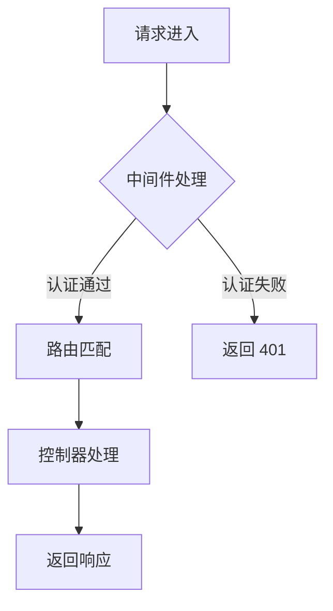
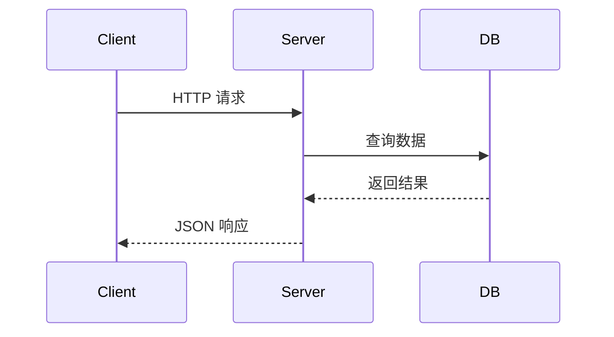
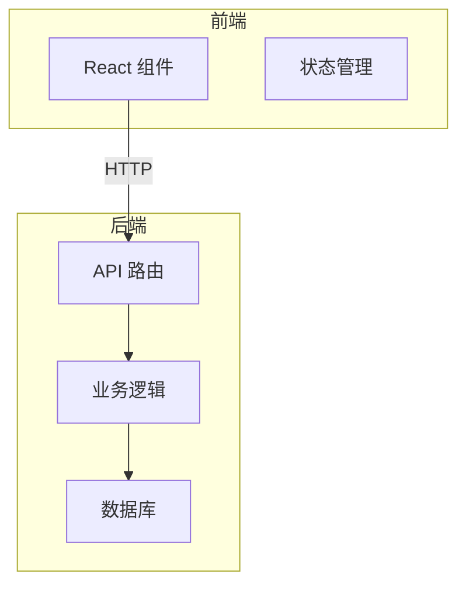

# 可视化辅助指南

本文件为知识模式和项目模式共用的可视化工具箱。在讲解、总结阶段灵活运用，帮助用户建立直观理解。

## 原则

- **用图不讲图**：图是辅助理解的工具，不是目的。能用一句话说清的不画图。
- **终端优先 ASCII**：在终端实时对话中，优先使用 ASCII 图示确保用户直接可见。Mermaid 代码块在 CLI 中只会显示源码，用户看不到图形。仅在生成持久化的总结文档 (.md) 时才使用 Mermaid 生成复杂图表。
- **匹配场景**：不同知识点适合不同形式的图，见下表。
- **渐进展示**：先讲核心流程的简图，细节在后续节点中展开，不要一次画完整架构图。

## 图表类型选择

| 场景 | 推荐形式 | 示例 |
|------|----------|------|
| 执行流程 / 数据流转 | Mermaid 流程图 | React Fiber 渲染流程、请求生命周期 |
| 模块关系 / 依赖关系 | Mermaid 图或 ASCII | Express 中间件链、React 组件树 |
| 架构层次 | 分层 ASCII 图 | MVC 架构、TCP/IP 分层 |
| 状态变化 / 时序 | Mermaid 时序图 | WebSocket 握手、React Hooks 调用顺序 |
| 对比差异 | 表格 | var/let/const 对比、TCP vs UDP |
| 数据结构 | ASCII 图示 | 链表、树、Fiber 节点结构 |
| 算法步骤 | ASCII + 代码注释 | 排序过程演示 |

## Mermaid 图模板

### 流程图


```mermaid
graph TD
    A[请求进入] --> B{中间件处理}
    B -->|认证通过| C[路由匹配]
    B -->|认证失败| D[返回 401]
    C --> E[控制器处理]
    E --> F[返回响应]
```

### 时序图


```mermaid
sequenceDiagram
    participant Client
    participant Server
    participant DB
    Client->>Server: HTTP 请求
    Server->>DB: 查询数据
    DB-->>Server: 返回结果
    Server-->>Client: JSON 响应
```

### 架构图


```mermaid
graph TB
    subgraph 前端
        A[React 组件]
        B[状态管理]
    end
    subgraph 后端
        C[API 路由]
        D[业务逻辑]
        E[数据库]
    end
    A -->|HTTP| C
    C --> D
    D --> E
```

## ASCII 图示模板

### 分层架构

```
┌─────────────────────────┐
│      应用层 (HTTP)       │  ← 你写的 Express 路由
├─────────────────────────┤
│      传输层 (TCP)        │  ← socket.io 底层依赖
├─────────────────────────┤
│      网络层 (IP)         │
├─────────────────────────┤
│      数据链路层          │
└─────────────────────────┘
```

### 数据结构

```
Fiber 节点结构:
┌──────────┐
│  return   │──→ 父节点
├──────────┤
│  child    │──→ 第一个子节点
├──────────┤
│ sibling   │──→ 下一个兄弟节点
├──────────┤
│  state    │   状态数据
│  props    │   属性数据
└──────────┘
```

### 流程图

```
用户点击 → 触发 setState
              ↓
         入队更新(updateQueue)
              ↓
         调度器(Scheduler)决定优先级
              ↓
       ┌──────┴──────┐
    高优先级        低优先级
       ↓              ↓
   立即渲染        延后渲染
       ↓              ↓
       └──────┬──────┘
              ↓
       生成 Fiber 树(reconciliation)
              ↓
         提交到 DOM(commit)
```

## 表格使用场景

### 对比型

| 特性 | HTTP 轮询 | WebSocket | SSE |
|------|----------|-----------|-----|
| 方向 | 客户端→服务端 | 双向 | 服务端→客户端 |
| 实时性 | 低（依赖轮询间隔） | 高 | 高 |
| 开销 | 高（反复建连） | 低（一次握手） | 低 |
| 适用场景 | 低频查询 | 聊天/游戏 | 通知/推送 |

### 演进型（展示知识点的递进关系）

```
阶段1: 基础概念
  ↓ 掌握后进入
阶段2: 进阶机制
  ↓ 掌握后进入
阶段3: 高级应用
```

## 总结文档中的图

在 Phase 4（阶段总结）生成的归档文档中，应当包含：
- 该阶段核心流程的 Mermaid 图（方便用户在支持 Mermaid 的阅读器中查看）
- 关键结构的 ASCII 图示（纯文本环境下也能看）
- 对比表格（快速回顾差异）
- `visual_tool` 为 `html` 时，在相关段落插入已生成 HTML 文件的相对路径链接，格式：`> 可视化: [流程图](../visuals/{filename}.html)`

在文档开头注明：`> 本文包含 Mermaid 图表，推荐在支持 Mermaid 渲染的 Markdown 阅读器中查看（如 VS Code、Obsidian、Typora）。`

## HTML 可视化模式

当 `config.yaml` 中 `visual_tool` 为 `html` 时，使用本节规则生成可视化 HTML 文件。

### 输出规则

- **目录**：`./ai-tutor/visuals/`（首次使用时自动创建）
- **命名**：`{topic-slug}-{chart-type}.html`，如 `react-hooks-flowchart.html`、`fiber-structure.html`
- **双输出**：终端内展示 2-3 行 ASCII 摘要（即时可见），同时写入 HTML 文件
- **持久保留**：HTML 文件不删除，同名覆盖，供后续回顾
- **自动打开**：写入后执行 `start ./ai-tutor/visuals/{filename}.html`（Windows）在浏览器打开
- **总结引用**：Phase 4 归档 .md 中用 `> 可视化: [名称](../visuals/{filename}.html)` 引用

### 基础 HTML 模板

所有图表共享此基础结构。`{CHART_CONTENT}` 和 `{CHART_CSS}` 根据图表类型替换。

```html
<!DOCTYPE html>
<html lang="zh-CN">
<head>
  <meta charset="UTF-8">
  <meta name="viewport" content="width=device-width, initial-scale=1.0">
  <title>{TITLE} - AI Tutor</title>
  <style>
    * { margin: 0; padding: 0; box-sizing: border-box; }
    body {
      font-family: "Microsoft YaHei", "PingFang SC", "Helvetica Neue", sans-serif;
      background: #1e1e2e;
      color: #cdd6f4;
      padding: 2rem;
      line-height: 1.6;
    }
    .header { max-width: 1000px; margin: 0 auto 2rem; }
    .header h1 { font-size: 1.5rem; color: #cba6f7; }
    .header .meta { font-size: 0.85rem; color: #6c7086; margin-top: 0.3rem; }
    .content { max-width: 1000px; margin: 0 auto; }
    .footer { max-width: 1000px; margin: 2rem auto 0; font-size: 0.8rem; color: #585b70; border-top: 1px solid #313244; padding-top: 1rem; }
    {CHART_CSS}
  </style>
</head>
<body>
  <div class="header">
    <h1>{TITLE}</h1>
    <div class="meta">AI Tutor · {DATE}</div>
  </div>
  <div class="content">
    {CHART_CONTENT}
  </div>
  <div class="footer">AI Tutor 可视化生成</div>
</body>
</html>
```

### Mermaid 图表类型（流程图、时序图、架构图）

这三种图表使用 Mermaid.js CDN 渲染，在基础模板 `</body>` 前追加：

```html
<script type="module">
  import mermaid from 'https://cdn.jsdelivr.net/npm/mermaid@11/dist/mermaid.esm.min.mjs';
  mermaid.initialize({ startOnLoad: true, theme: 'dark' });
</script>
```

`{CHART_CONTENT}` 为 `<pre class="mermaid">{MERMAID_CODE}</pre>`，`{CHART_CSS}` 追加：

```css
.content { display: flex; justify-content: center; }
.mermaid { background: #181825; border-radius: 8px; padding: 1.5rem; }
```

#### 流程图

Mermaid 语法：`graph TD` 或 `graph LR`，示例 `{CHART_CONTENT}`：

```html
<pre class="mermaid">
graph TD
    A[请求进入] --> B{中间件处理}
    B -->|认证通过| C[路由匹配]
    B -->|认证失败| D[返回 401]
    C --> E[控制器处理]
    E --> F[返回响应]
</pre>
```

#### 时序图

Mermaid 语法：`sequenceDiagram`，容器改为 `max-width: 800px`。

#### 架构图

Mermaid 语法：`graph TB` + `subgraph`，容器改为 `max-width: 1000px`。

### 纯 CSS 图表类型

以下类型不加载 Mermaid CDN，全部用内联 CSS 实现。

#### 分层架构图

`{CHART_CSS}` 追加：

```css
.layer-stack { display: flex; flex-direction: column; gap: 0; max-width: 600px; }
.layer-item {
  padding: 1rem 1.5rem;
  border: 1px solid #45475a;
  text-align: center;
  font-size: 1rem;
}
.layer-item:first-child { border-radius: 8px 8px 0 0; }
.layer-item:last-child { border-radius: 0 0 8px 8px; }
.layer-item + .layer-item { border-top: none; }
.layer-label { font-size: 0.8rem; color: #a6adc8; margin-top: 0.3rem; }
.layer-item:nth-child(odd) { background: #181825; }
.layer-item:nth-child(even) { background: #1e1e2e; }
```

`{CHART_CONTENT}` 示例：

```html
<div class="layer-stack">
  <div class="layer-item">应用层 (HTTP)<div class="layer-label">Express 路由</div></div>
  <div class="layer-item">传输层 (TCP)<div class="layer-label">socket.io 底层</div></div>
  <div class="layer-item">网络层 (IP)</div>
  <div class="layer-item">数据链路层</div>
</div>
```

#### 数据结构图

`{CHART_CSS}` 追加：

```css
.struct-box { border: 2px solid #89b4fa; border-radius: 8px; max-width: 400px; overflow: hidden; }
.struct-title { background: #89b4fa; color: #1e1e2e; padding: 0.5rem 1rem; font-weight: bold; }
.struct-field { display: flex; justify-content: space-between; padding: 0.5rem 1rem; border-top: 1px solid #313244; }
.struct-field-name { color: #a6e3a1; font-family: monospace; }
.struct-field-desc { color: #6c7086; font-size: 0.9rem; }
```

`{CHART_CONTENT}` 示例：

```html
<div class="struct-box">
  <div class="struct-title">Fiber 节点</div>
  <div class="struct-field"><span class="struct-field-name">return</span><span class="struct-field-desc">→ 父节点</span></div>
  <div class="struct-field"><span class="struct-field-name">child</span><span class="struct-field-desc">→ 第一个子节点</span></div>
  <div class="struct-field"><span class="struct-field-name">sibling</span><span class="struct-field-desc">→ 下一个兄弟节点</span></div>
  <div class="struct-field"><span class="struct-field-name">state</span><span class="struct-field-desc">状态数据</span></div>
  <div class="struct-field"><span class="struct-field-name">props</span><span class="struct-field-desc">属性数据</span></div>
</div>
```

#### 对比表格

`{CHART_CSS}` 追加：

```css
.compare-table { width: 100%; border-collapse: collapse; }
.compare-table th { background: #313244; color: #cba6f7; padding: 0.75rem 1rem; text-align: left; font-size: 0.9rem; }
.compare-table td { padding: 0.75rem 1rem; border-bottom: 1px solid #313244; font-size: 0.9rem; }
.compare-table tr:hover td { background: #181825; }
.compare-table th:first-child { border-radius: 6px 0 0 0; }
.compare-table th:last-child { border-radius: 0 6px 0 0; }
```

`{CHART_CONTENT}` 示例：

```html
<table class="compare-table">
  <thead><tr><th>特性</th><th>HTTP 轮询</th><th>WebSocket</th><th>SSE</th></tr></thead>
  <tbody>
    <tr><td>方向</td><td>客户端→服务端</td><td>双向</td><td>服务端→客户端</td></tr>
    <tr><td>实时性</td><td>低</td><td>高</td><td>高</td></tr>
    <tr><td>开销</td><td>高</td><td>低</td><td>低</td></tr>
  </tbody>
</table>
```

#### 进度面板

`{CHART_CSS}` 追加：

```css
.dashboard { max-width: 700px; }
.dashboard-title { font-size: 1.2rem; color: #cba6f7; margin-bottom: 1.5rem; padding-bottom: 0.5rem; border-bottom: 1px solid #313244; }
.module-card { background: #181825; border-radius: 8px; padding: 1rem 1.2rem; margin-bottom: 0.8rem; }
.module-name { font-size: 1rem; color: #cdd6f4; margin-bottom: 0.3rem; }
.module-status { font-size: 0.8rem; margin-bottom: 0.5rem; }
.status-done { color: #a6e3a1; }
.status-active { color: #f9e2af; }
.status-pending { color: #6c7086; }
.progress-track { background: #313244; border-radius: 4px; height: 8px; overflow: hidden; }
.progress-fill { height: 100%; border-radius: 4px; transition: width 0.3s; }
.fill-done { background: #a6e3a1; }
.fill-active { background: #f9e2af; }
.fill-pending { background: #45475a; }
.stats-row { display: flex; gap: 1.5rem; margin-top: 1rem; padding-top: 1rem; border-top: 1px solid #313244; font-size: 0.9rem; color: #a6adc8; }
```

`{CHART_CONTENT}` 根据实际学习记录数据生成，包含各模块的进度条和统计信息。

#### 复习提醒卡片

`{CHART_CSS}` 追加：

```css
.reminder-card { max-width: 500px; background: #181825; border: 1px solid #f9e2af; border-radius: 8px; padding: 1.5rem; }
.reminder-title { color: #f9e2af; font-size: 1.1rem; margin-bottom: 1rem; }
.reminder-item { padding: 0.5rem 0; border-bottom: 1px solid #313244; }
.reminder-item:last-child { border-bottom: none; }
.reminder-name { color: #cdd6f4; }
.reminder-time { font-size: 0.8rem; color: #6c7086; }
```

`{CHART_CONTENT}` 根据实际到期复习节点数据生成。

### 使用流程

当需要生成可视化内容时：

1. 根据知识点类型选择合适的图表类型（参考"图表类型选择"表）
2. 用基础模板组装 HTML，填入图表内容
3. 用 Write 工具写入 `./ai-tutor/visuals/{topic-slug}-{chart-type}.html`
4. 用 Bash 执行 `start ./ai-tutor/visuals/{filename}.html` 在浏览器打开
5. 在终端内输出 2-3 行 ASCII 摘要，并告知用户文件路径

## 学习进度面板

当用户调用 `/ai-tutor status` 时，用 ASCII 生成学习进度面板。

### 单主题进度

```
╔══════════════════════════════════════════════╗
║           AI Tutor 学习面板                  ║
╠══════════════════════════════════════════════╣
║                                              ║
║  📚 React Hooks                              ║
║  模式: 知识模式                               ║
║  开始: 2026-04-10                            ║
║                                              ║
║  模块1: 基础                        [已完成] ║
║  ████████████████████████████████████ 100%   ║
║                                              ║
║  模块2: 进阶 Hooks                  [学习中] ║
║  ████████████░░░░░░░░░░░░░░░░░░░░░░  40%   ║
║  └ 2.3 useRef ........................ [学习中]║
║                                              ║
║  模块3: 自定义 Hooks                [未开始] ║
║  ░░░░░░░░░░░░░░░░░░░░░░░░░░░░░░░░░░   0%   ║
║                                              ║
║  总进度: 58%                                 ║
║  ████████████████████░░░░░░░░░░░░░░░░░░░░░  ║
║                                              ║
║  📊 统计                                     ║
║  已掌握: 7 个知识点                           ║
║  学习中: 1 个                                 ║
║  待学习: 4 个                                 ║
║  失败重试: 3 次                               ║
║                                              ║
╚══════════════════════════════════════════════╝
```

### 多主题总览

当用户有多个学习记录时：

```
╔══════════════════════════════════════════════╗
║           AI Tutor 全局面板                  ║
╠══════════════════════════════════════════════╣
║                                              ║
║  1. React Hooks          [知识] ██████░░ 75% ║
║  2. Node.js 聊天室       [项目] ███░░░░░ 35% ║
║  3. TypeScript 泛型      [知识] ████████ 100%║
║                                              ║
║  累计: 已掌握 28 个知识点 | 完成 3/5 个模块   ║
║                                              ║
╚══════════════════════════════════════════════╝
```

### 复习提醒

当检测到需要间隔复习时：

```
╔══════════════════════════════════════════════╗
║           ⚡ 课前提醒                         ║
╠══════════════════════════════════════════════╣
║                                              ║
║  以下知识点已到复习时间:                      ║
║                                              ║
║  📌 useState (3天前掌握)                     ║
║  📌 useEffect 闭包陷阱 (5天前掌握)           ║
║                                              ║
║  准备好了吗？我们快速复习一下再继续新课。      ║
║                                              ║
╚══════════════════════════════════════════════╝
```
